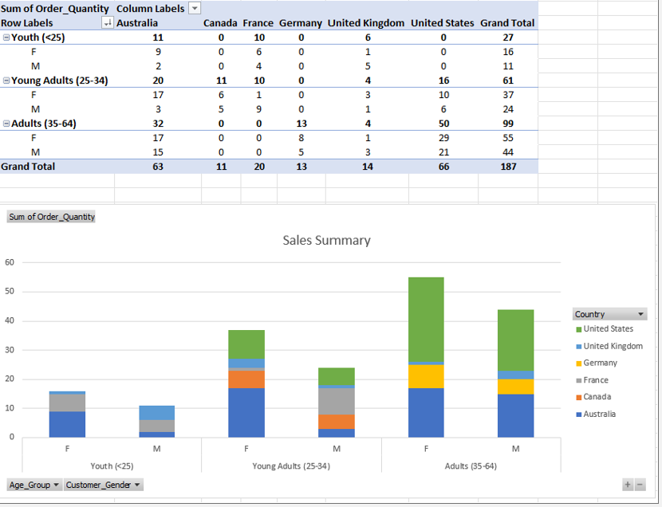

# 📚 Data Analysis Bootcamp | Weekly Workbooks & Projects

**Programme:** Data Technician Bootcamp (UK)  
**Tools Used:** Excel, Power BI, Tableau, SQL, Python (Pandas), Microsoft Azure, Power Query, Matplotlib, DAX, VLOOKUP/XLOOKUP, PivotTables  
**Focus Areas:** Data Preparation, Analysis, Dashboarding, Visualisation, Cloud Services, SQL Queries, Python Scripting, GDPR & Data Ethics

---

## 📊 Overview

This repository documents my learning journey as part of a data analysis bootcamp. Each workbook contains weekly tasks, reflections, and applied exercises across a range of data tools and scenarios — from Excel and Power BI labs to Python, SQL, and data ethics.

---

## 📂 Contents

| Week | Focus | Highlight |
|------|-------|----------|
| [Week 1](Workbooks/Week_1/) | Excel & Data Governance | VLOOKUP, Pivot Tables, DPA, GDPR |
| [Week 2](Workbooks/Week_2/) | Power BI & Dashboards | Spotify & NHS dashboards |
| [Week 3](Workbooks/Week_3/) | SQL & Data Relationships | Inner/Outer Joins, RDBMS structure |
| [Week 5](Workbooks/Week_5/) | Cloud Platforms & Visualisation | Azure Data Tools, Power BI design |
| [Week 6](Workbooks/Week_6/) | Python & Data Wrangling | Pandas pivoting, matplotlib charts |

---

## 🖼️ Visual Highlights

### 📘 Week 1 – Excel Essentials: Lookups, Pivot Tables & Segmentation

#### 🔍 VLOOKUP/XLOOKUP Formula in Action

  
*Dynamic lookup between tables using VLOOKUP/XLOOKUP to match and retrieve employee details.*

---

#### 📊 Pivot Table: Bike Sales Summary

  
*Summarised sales performance by region and product using Excel PivotTables.*

---

#### 🔄 SWITCH Function: Sales Segmentation

  
*Custom sales performance categorisation using SWITCH logic — classifying sales as High, Medium, or Low and linking to segmented summary.*

This week built my foundation in Excel and helped me understand how structured functions and summarisation tools like pivot tables can reveal hidden trends quickly.

---

### 📘 Week 2 – Data Visualisation with Tableau

#### 🎵 Spotify Music Trends Dashboard

  
*Explored listening trends across genres using Tableau — highlighting energy, danceability, and popularity for user engagement insights.*

---

#### 📈 UK Job Change (EMSI Dataset)

  
*Visualised employment changes using bar charts and a UK map — highlighting sector impact across major cities.*

---

#### 🏥 NHS Health Insights Dashboard

  
*Analysed life expectancy, obesity, and cancer rates across regions to support health service planning and trend analysis.*

---

This week helped me develop practical skills in both Tableau and Power BI. I used Tableau to create interactive dashboards that communicated real-world insights from music and healthcare data, while the Power BI labs strengthened my understanding of data loading, transformation, and report design.

---

### 📘 Week 3 – SQL & Relational Database Design

#### 🔄 SQL Join Query Example

  
*Used JOIN operations to combine related tables and retrieve connected data.*

---

#### 🏗️ Database Design & Table Structures

  
*Outlined the structure of a retail business database using SQL table definitions and explained how relational models support scalable analysis.*

---

#### 📊 SQL Practical Query Outputs

  
*Ran filtering and aggregation queries using real-world datasets to count entries, apply conditions, and explore relationships between data tables.*

---
I gained confidence in relational database design and SQL querying. I used join operations to combine datasets, designed a retail database structure, and ran practical queries to retrieve, filter, and count key data values.

### 📘 Week 5 – Cloud Platforms, Azure Labs & Scenario Planning

#### ☁️ Azure Labs Overview

  
*Completed guided labs on relational data, non-relational data, and analytics services in Azure. This included exploring data lake storage, SQL databases, and using Azure Synapse for querying.*

---

#### 🐾 Azure Recommendations – Paws & Whiskers Case Study

  
*Proposed a cloud architecture solution using Azure Data Factory, Power BI, and Blob Storage to modernise a pet supply company's data pipeline.*

---

This week deepened my understanding of cloud platforms and data architecture. I explored how Azure handles relational and non-relational data, and applied that knowledge to design a real-world solution for a fictional business.
I explored how data flows through cloud-based systems and gained a clearer view of where analysts and data engineers fit within that process.
---

### 📘 Week 6 – Python & Jupyter for Data Analysis

#### 🧮 Data Cleaning & Exploration (Student Dataset)

  
*Loaded and explored student data using Pandas; cleaned missing values and reviewed summary statistics.*

---

#### 📊 Grouped Aggregation & Pivot Table

  
*Created grouped views of student performance by class and gender using Pandas and pivot tables.*

---

#### 🌍 GDP per Capita Analysis

  
*Analysed GDP per capita across countries and UN regions, filtering and slicing data programmatically.*

---
 
In Week 6, I applied Python and the Pandas library to explore, clean, manipulate, and analyse datasets programmatically using Jupyter Notebook. I worked with both structured (student.csv) and real-world data (GDP per capita), performing grouping, aggregation, and pivoting. I also practised data visualisation using Matplotlib, Seaborn, and Plotly, enhancing my ability to present trends and patterns clearly and interactively.

---

## ✅ Skills Developed

- Excel lookups, pivot tables, and automation functions
- RDBMS concepts and SQL query writing
- Power BI dashboarding and DAX basics
- Python for data wrangling and visualisation
- Understanding of GDPR, data ethics, and cloud services (Azure)
- Created interactive dashboards in Tableau Public for location-based and trend analyses using real-world datasets such as EMSI (UK Job Changes) and Spotify listening trends.
- Familiarity with **cloud computing concepts** and tools, including Azure data services

---

## 🎯 Reflections

These workbooks reflect my progression as a data analyst in training — balancing technical skills, written analysis, and critical thinking. Each week presented new challenges and opportunities to build confidence across the data lifecycle.

---

👋 **Let’s connect!**  
Feel free to explore more of my work on [GitHub](https://github.com/sora-tavares) or connect with me on [LinkedIn](https://www.linkedin.com/in/soraiatavares/)

